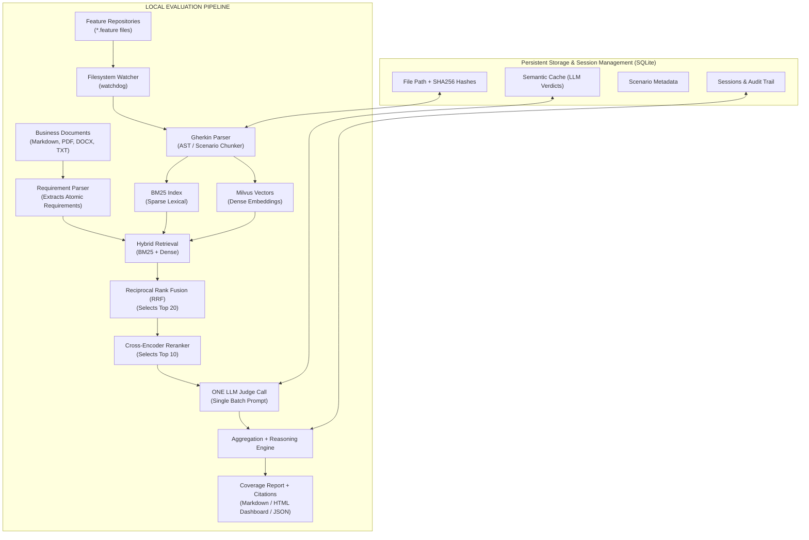

# 🔍 Local RAG Requirement & Test Coverage Engine

An automated, local Retrieval-Augmented Generation (RAG) system that evaluates whether Business Requirements are covered by automated Gherkin (`.feature`) test scenarios, with persistent **SQLite Session Management**.

## 🏗️ Architecture



---

## ⚡ Key Features

1. **SQLite Session Management**:
   - Tracks evaluation session runs, metadata, start/finish timestamps, and KPIs.
   - Stores granular requirement audit trails per session.
   - Computes coverage progression diffs (`sessions diff <session_1> <session_2>`) to monitor test suite improvements over time.
2. **Dual Ingestion**:
   - **Gherkin Parser**: Parses features, backgrounds, scenarios, scenario outlines, tags, and step tables into context-rich searchable chunks.
   - **Requirement Parser**: Chunks business documents into atomic requirements with IDs, acceptance criteria, and categories.
3. **Real-Time Indexing**:
   - **Filesystem Watcher**: Listens for `.feature` additions, modifications, and deletions with debouncing, synchronizing indices in real-time.
4. **Hybrid Retrieval with Reciprocal Rank Fusion (RRF)**:
   - Queries **BM25** (sparse lexical) and **Milvus Lite** (dense vector embeddings) concurrently.
   - Merges candidate ranks with RRF: $RRF(d) = \sum \frac{1}{k + rank(d)}$, isolating **Top 20** candidate scenarios.
5. **Cross-Encoder Reranking**:
   - Scores requirement-scenario pairs with a cross-encoder model to surface the **Top 10** most relevant tests.
6. **ONE LLM Judge Call & Semantic Cache**:
   - Evaluates the requirement against all Top 10 candidates simultaneously in a single batch prompt.
   - Caches verdicts in SQLite to eliminate redundant LLM calls.
7. **Executive Reporting & Citations**:
   - Outputs **Markdown (`.md`)**, **JSON (`.json`)**, and a standalone **Interactive HTML Dashboard (`.html`)** with instant filtering, search, and scenario citations.

---

## 🚀 Quickstart

### 1. Setup Virtual Environment
```bash
python -m venv venv
.\venv\Scripts\activate
pip install -r requirements.txt
```

### 2. Configure LLM API Keys (Optional)
```bash
# For Google Gemini:
$env:GEMINI_API_KEY="your-gemini-key"

# Or for OpenAI:
$env:OPENAI_API_KEY="your-openai-key"
```
*(If no API key is provided, the system seamlessly uses the local heuristic judge for offline testing.)*

### 3. Run Coverage Evaluation (Creates a Persisted Session)
```bash
python src/cli.py evaluate --docs sample_data/business_docs --features sample_data/feature_repos --session-name "Sprint 42 Release"
```

### 4. Manage & Compare SQLite Sessions
```bash
# List all evaluation sessions
python src/cli.py sessions list

# Show detailed requirement audit trail for a session
python src/cli.py sessions show sess_01b7f049a34c

# Compare coverage progression diff between two sessions
python src/cli.py sessions diff sess_baseline sess_target
```

### 5. Interactive Query
Test retrieval and reranking for any requirement string:
```bash
python src/cli.py query -q "User login with valid email and password" --features sample_data/feature_repos
```

### 6. Live Filesystem Watcher
Automatically re-index as you edit Gherkin test files:
```bash
python src/cli.py watch --features sample_data/feature_repos
```

---

## 🧪 Running Tests

```bash
.\venv\Scripts\python.exe -m pytest -v
```


TO LAUNCH THE INTERACTIVE WEB UI 
coverage-agent serve --port 8000